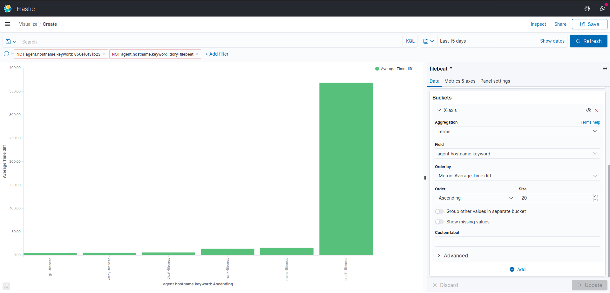

# [CC4081] Security Operations - ELK stack

## Details

### Deployment:
  * Server
    ```shell
    docker-compose up -d
    ```
  * Nodes
    ```shell
    cd nodes && docker-compose up -d 
    ```

### Use  
  * To access both ElasticSearch and Kibana add to your */etc/hosts* the following:
    ```shell
    127.0.0.1	elastic.secop.edu
    127.0.0.1	kibana.secop.edu
    ```
  * Test it:
      * cURL - `curl -v elastic.secop.edu:80`
      * Browser - <http://kibana.secop.edu>
  
### Kibana visualisation
  * **Eval time difference of log arriving**
    * Add script field with the follow settings:
      * Name: Time diff
      * Language: painless
      * Type: number
      * Format: duration
      * Input format: seconds
      * Output format: seconds
      * Script:
          ```
          if(!doc['filebeattimestamp'].empty) { 
            return (doc['@timestamp'].value.millis - doc['filebeattimestamp'].value.millis) / 1000
          }
          ```
    * In *Discover* tab filter the logs by the new variable *Time diff*
      

    * For a graphic with the average time go to visualize and fill the settings:
        * Metrics
            * Y-axis
              ```shell
              Aggregation: Average
              Field: Time diff
              ```
            * X-axis
                ```shell
                Aggregation: Terms
                Field: agent.hostname.keyword
                Order by: Metric: Average Time diff
                Order: Ascending
                ```
        
